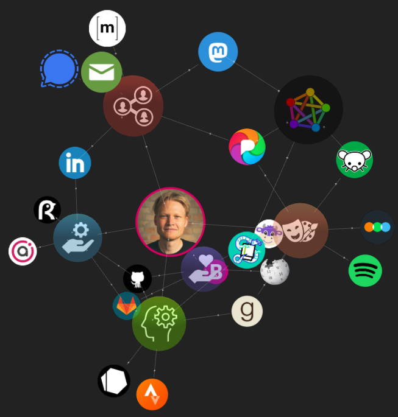

## Homepage

## Projects
* [My Nix Files](https://github.com/noverby/nixfiles)
* [RadikalWiki](https://github.com/RadikalWiki/radikalwiki)

## Github Stats

## Stack
 * ✅: Good for now
 * 🚧: Transitioning
 * 🚫: Blocked
 * ❓: Undecided
 * 🆗: Not needed
 * ⬅️: Backward compatible

### Hardware
| Status | Component | Upcoming | Current | Legacy |
|:-:|-|-|-|-|
| ✅ | Laptop |  | [Framwork 13](https://frame.work/products/laptop-diy-13-gen-intel) | [Dell XPS 13 Plus 9320](https://www.dell.com/support/home/da-dk/product-support/product/xps-13-9320-laptop) |
| ✅ | Mobile |  | [Samsung Galaxy S23 Plus](https://www.samsung.com/dk/smartphones/galaxy-s23) | [Google Pixel 8 Pro](https://store.google.com/product/pixel_8_pro) + [GrapheneOS](https://grapheneos.org) |
| ✅ | Watch |  | [Fēnix 7 – Sapphire Solar Edition](https://www.garmin.com/en-US/p/735520) | [PineTime](https://www.pine64.org/pinetime) |
| ✅ | AR Glasses | [XREAL Air 2 Pro](https://us.shop.xreal.com/products/xreal-air-2-pro) | [XReal Air](https://www.xreal.com/air) | [XReal Light](https://www.xreal.com/light/) |
| 🚫 | Input | [Tap XR](https://www.tapwithus.com/product/tap-xr) | [Tap Strap 2](https://www.tapwithus.com/product/tap-strap-2) | Keyboard/Touch Screen |
| ✅ | Earphones | [Hyphen Aria](https://www.kickstarter.com/projects/rollingsquare/hyphen-aria-the-first-biological-earbuds) | [Aftershokz Openrun Pro Mini](https://shokz.com/products/openrunpro) | [Aftershokz Openrun](https://shokz.com/products/openrun) |

### Base
| Status | Component | Upcoming | Current | Compat | Legacy |
|:-:|-|-|-|-|-|
| 🚧 | Config Language | [Nickel](https://github.com/tweag/nickel) | [Nix](https://github.com/NixOS/nix) | [Organist](https://github.com/nickel-lang/organist) |  |
| 🚧 | Package Manager | [Tvix](https://github.com/tvlfyi/tvix) | [Nix](https://github.com/NixOS/nix) | ⬅️ |  |
| ✅ | 2D Toolkit | | [Iced](https://github.com/iced-rs/iced) | [Cosmic Gtk Theme](https://github.com/pop-os/gtk-theme) | [GTK](https://gitlab.gnome.org/GNOME/gtk), [Qt](https://github.com/qt/qt5) |
| 🚧   https://github.com/NixOS/nixpkgs/issues/259641 | Desktop Environment | [Cosmic Epoch](https://github.com/pop-os/cosmic-epoch) | [Cosmic](https://github.com/pop-os/cosmic) | [Gnome Shell](https://gitlab.gnome.org/GNOME/gnome-shell) |
| 🚫 | Web Browser | [Servo](https://github.com/servo/servo) | [Firefox](https://github.com/mozilla/gecko-dev) | [Chrome Extension API](https://developer.chrome.com/docs/extensions/reference) |  |
| 🚧 | Web Runtime | [Deno](https://github.com/denoland/deno), [Bun](https://github.com/oven-sh/bun) | [Node.js API](https://nodejs.org/api) | [Node.js](https://github.com/nodejs/node) |
| ✅ | Distro | | [NixOS](https://github.com/NixOS/nixpkgs) | [OCI](https://github.com/opencontainers/runtime-spec), [Distrobox](https://github.com/89luca89/distrobox) | [Fedora Silverblue](https://fedoraproject.org/silverblue/) |
| 🚧 | Container CLI | | [Podman](https://github.com/containers/podman) | [OCI](https://github.com/opencontainers/runtime-spec) | [Docker](https://github.com/docker) |
| 🚧 | Container Runtime | | [Youki](https://github.com/containers/youki) | [OCI](https://github.com/opencontainers/runtime-spec) | [Runc](https://github.com/opencontainers/runc) |
| ✅ | Typesetting |  | [Typst](https://github.com/typst/) | ❓ | [LaTeX](https://github.com/latex3/latex3) |

### Shell
| Status | Component | Upcoming | Current | Compat | Legacy |
|:-:|-|-|-|-|-|
| ✅ | Shell | | [Nushell](https://github.com/nushell/nushell)| ❓ | [Bash](https://git.savannah.gnu.org/cgit/bash.git) |
| ✅ | Core Utilities | | [Nushell Builtins](https://github.com/nushell/nushell) | [uutils](https://github.com/uutils/coreutils) | [Coreutils](https://git.savannah.gnu.org/cgit/coreutils.git) |
| ✅ | Copy | | [Xcp](https://github.com/tarka/xcp) | [uutils](https://github.com/uutils/coreutils) | [Coreutils](https://git.savannah.gnu.org/cgit/coreutils.git) |
| ✅ | Remove | | [Rip](https://github.com/nivekuil/rip) | [uutils](https://github.com/uutils/coreutils) | [Coreutils](https://git.savannah.gnu.org/cgit/coreutils.git) |
| ✅ | Cut Text | | [Choose](https://github.com/theryangeary/choose) | [uutils](https://github.com/uutils/coreutils) | [Coreutils](https://git.savannah.gnu.org/cgit/coreutils.git) |
| ✅ | Directory Usage | | [Dust](https://github.com/bootandy/dust) | [uutils](https://github.com/uutils/coreutils) | [Coreutils](https://git.savannah.gnu.org/cgit/coreutils.git) | 
| 🚫 | Superuser | [Sudo-rs](https://github.com/memorysafety/sudo-rs) | [Sudo](https://www.sudo.ws/repos/sudo) | ⬅️ | |
| ✅ | Fortune | | [Fortune-kind](https://github.com/cafkafk/fortune-kind) | ⬅️ | [Fortune-mod](https://github.com/shlomif/fortune-mod) |
| ✅ | Find Files | | [Fd](https://github.com/sharkdp/fd) | 🆗 | [Findutils](https://git.savannah.gnu.org/cgit/findutils.git) |
| ✅ | Find Patterns | | [Ripgrep](https://github.com/BurntSushi/ripgrep) | 🆗 | [Grep](https://git.savannah.gnu.org/cgit/grep.git) |
| ✅ | Regex Edit | | [Sd](https://github.com/chmln/sd) | ❓ | [Sed](https://git.savannah.gnu.org/cgit/sed.git) |
| ✅ | Terminal Workspace | | [Zellij](https://github.com/zellij-org/zellij) | 🆗 | [Tmux](https://github.com/tmux/tmux) |

### Dev
| Status | Component | Upcoming | Current | Compat | Legacy |
|:-:|-|-|-|-|-|
| 🚫 | Compiler Framework | [Cranelift](https://github.com/bytecodealliance/wasmtime/tree/main/cranelift), [Zig](https://github.com/ziglang/zig) | [LLVM](https://github.com/llvm/llvm-project) | ⬅️ | |
| ✅ | System Language | | [Rust](https://github.com/rust-lang/rust), [Zig](https://github.com/ziglang/zig) |  [cxx](https://github.com/dtolnay/cxx), [bindgen](https://github.com/rust-lang/rust-bindgen) |  [Clang](https://github.com/llvm/llvm-project) |
| 🚫 | Scripting Language | [Roc](https://github.com/roc-lang/roc) | [TypeScript](https://github.com/microsoft/TypeScript) | [RustPython](https://github.com/RustPython/RustPython), [WASI](https://github.com/WebAssembly/WASI) | [Python](https://github.com/python/cpython) | 
| ✅ | Build Script| | [Just](https://github.com/casey/just) | ❓ | [GNU Make](https://git.savannah.gnu.org/cgit/make.git) |
| ✅ | Editor | | [Helix](https://github.com/helix-editor/helix) | 🆗 | [Neovim](https://github.com/neovim/neovim), [Vim](https://github.com/vim/vim) |
| ❓ | IDE | ❓ | [VS Codium](https://github.com/VSCodium/vscodium) | [LSP](https://github.com/microsoft/language-server-protocol), [DAP](https://github.com/Microsoft/debug-adapter-protocol), [BSP](https://github.com/build-server-protocol/build-server-protocol) |
| ✅ | JSON Query | | [Jql](https://github.com/yamafaktory/jql) | 🆗 | [Jq](https://github.com/jqlang/jq) |
| ✅ | System Call Tracing | | [Lurk](https://github.com/JakWai01/lurk) | 🆗 | [Strace](https://github.com/strace/strace) |
| ✅ | Optimize PNG | | [Oxipng](https://github.com/shssoichiro/oxipngc) | 🆗 | [Optpng](https://optipng.sourceforge.net) |
| 🚫 | Meta Database | [Surrealdb](https://github.com/surrealdb/surrealdb) | [Hasura](https://github.com/hasura/graphql-engine) | [GraphQL](https://graphql.org/) | 
| 🚫 | Database | [Tikv](https://github.com/tikv/tikv) | [Postgres](https://github.com/postgres/postgres) | ❓ |  |
| 🚫 | Storage Engine | [Sled](https://github.com/spacejam/sled) | | ❓ | [RocksDB](https://github.com/facebook/rocksdb) |

## Wish List

### Stack

### Helix
* [Nushell Helix Mode](https://github.com/nushell/reedline/issues/639)
* [VSCode Helix Keymap](https://github.com/71/dance/issues/299)  

#### Zig
* [Divorce from LLVM](https://github.com/ziglang/zig/issues/16270)
* [Comptime Interfaces](https://github.com/ziglang/zig/issues/1268)

#### Roc
* [Language Server](https://github.com/roc-lang/roc/tree/main/crates/lang_srv)

#### Matrix
* [Discord Forum Support](https://github.com/mautrix/discord/issues/101)

#### Nix
* [fromYAML builtin](https://github.com/NixOS/nix/pull/7340)
* [Allow derivations to hardlink](https://github.com/NixOS/nix/issues/1272)

### World

#### Mastodon
* [View Remote Followers](https://github.com/mastodon/mastodon/issues/20533)
* [View Old Posts](https://github.com/mastodon/mastodon/issues/17213)
* [Make Financial Supporters Visible](https://github.com/mastodon/mastodon/issues/5380)

### Legacy

#### Bun
* [Implement Node-API](https://github.com/oven-sh/bun/issues/158)

#### ECMAScript 
* [Pattern Matching](https://github.com/tc39/proposal-pattern-matching):
  * [Extractors](https://github.com/tc39/proposal-extractors)
* [Pipeline Operator](https://github.com/tc39/proposal-pipeline-operator):
  * [Call This](https://github.com/tc39/proposal-call-this)
* [Type Annotations](https://github.com/tc39/proposal-type-annotations)
* [Record & Tuple](https://github.com/tc39/proposal-record-tuple)
* [ADT Enum](https://github.com/Jack-Works/proposal-enum)
* [Do Expressions](https://github.com/tc39/proposal-do-expressions)
* [Operator Overloading](https://github.com/tc39/proposal-operator-overloading)
* [Array Grouping](https://github.com/tc39/proposal-array-grouping)

#### JS/TS Toolchain
* [Hegel: Static JS Type Checker](https://github.com/JSMonk/hegel)
* [Stc: Low-level TS Type Checker](https://github.com/dudykr/stc)

#### React/JSX
* [JSX Props Pruning](https://github.com/facebook/jsx/issues/23)
* [React Native Promise](https://github.com/acdlite/rfcs/blob/first-class-promises/text/0000-first-class-support-for-promises.md)

